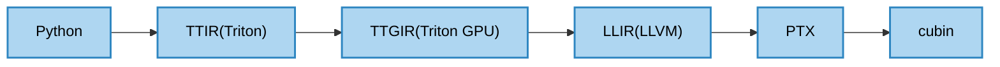

<h3 align="center">
Multi-Level Triton Runner Tool 🔧
</h3>

<p align="center">
<a href="./doc/"><b>Documentation</b></a> ｜ <a href="https://triton-runner.org"><b>🔗 triton-runner.org</b></a>
</p>

<p align="center">
<a ><b>English</b></a> | <a href="README.zh.md"><b>中文</b></a>
</p>

triton-runner is a lightweight, multi-level execution engine for [OpenAI/Triton](https://github.com/triton-lang/triton), designed to support IR/PTX/cubin launches in complex pass pipelines.

triton-runner is compatible with **Triton v3.4.0 (primary), v3.3.x, or v3.2.0**, and may not work with other versions.

## ✨ Features

- [multi-level execution](#multi-level-execution)
- [TTIR Debug](#ttir-debug)
- [Benchmark performance](#benchmarks)

## 📦 Installation

### Quick Installation

You can install the latest stable release of Triton from pip.

```shell
pip install triton-runner
```

### Install from source

You can install from source to access the latest features and developments.

```shell
git clone https://github.com/OpenMLIR/triton-runner
cd triton-runner

pip install -e .
```

## 🚀 Quick Start

See the provided examples in the [triton-runner.org](https://triton-runner.org) repository for your first run.

### multi-level execution

Triton’s all compilation levels are supported by triton-runner.



#### 1. Python runner

You can run your Triton code using `@triton_runner.jit` instead of `@triton.jit`. See an example in [examples/python_runner/matmul.py](https://github.com/OpenMLIR/triton-runner/blob/main/examples/python_runner/matmul.py#L12)

You can run the example with `python examples/python_runner/matmul.py`. After running successfully, you should see output like `[triton-runner] Triton cache saved`.

#### 2. TTIR runner

In addition to using `@triton_runner.jit` instead of `@triton.jit`, you also need to provide the TTIR file. You can place it in the same directory as the current Python file and use `ttir_dir=triton_runner.get_file_dir(__file__)`. See an example in [examples/ttir_runner/matmul.py](https://github.com/OpenMLIR/triton-runner/blob/main/examples/ttir_runner/matmul.py#L67). Alternatively, you can use the Triton cache directory generated by the Python runner(previous step).

You can run the example with `python examples/ttir_runner/matmul.py`.

#### 3. TTGIR/LLIR/PTX/cubin runner

In addition to using `@triton_runner.jit` instead of `@triton.jit`, you also need to provide the corresponding file. Like the TTGIR runner, You can place it in the same directory as the current Python file and use `ttgir_dir=triton_runner.get_file_dir(__file__)`. Since all of them are architecture-specific, be sure to use the corresponding metadata JSON file. See an example in [examples/ttgir_runner/sm90/matmul-with-tma-v4.py](https://github.com/OpenMLIR/triton-runner/blob/main/examples/ttgir_runner/sm90/matmul-with-tma-v4.py#L76).

If your architecture is `sm90`(Hopper), you can run the example using the TTGIR runner with `python examples/ttgir_runner/sm90/matmul-with-tma-v4.py`.

#### 4. Hopper examples with Triton v3.4.0

I provide examples for different architectures and Triton versions. Here's example commands for multi-level targeting `sm90 (H100, H200, H20, etc.)` with Triton v3.4.0.

```shell
python examples/python_runner/matmul.py

python examples/ttir_runner/matmul.py

python examples/ttgir_runner/sm90/matmul-with-tma-v4.py

python examples/llir_runner/sm90/matmul-with-tma-v4.py

python examples/ptx_runner/sm90/matmul-with-tma-v4.py

python examples/cubin_runner/sm90/matmul-with-tma-v4.py
```

#### 5. More architectures examples

Now provide examples for architectures include `sm90 (H100, H200, H20, etc.)`, `sm80 (A100, A30)`, `sm120 (RTX PRO 6000, RTX 5090, etc.)`, `sm86 (A10, RTX 3090, etc.)` or `sm75 (T4, RTX 2080, etc.)`. For these targets, please refer to [examples](./doc/examples_v3.4.0.md).

If your GPU does not have one of the above compute capabilities, you can use `TRITON_CACHE_DIR=$PWD/.cache` to output the Triton cache to the current directory, and use this kernel cache directory to run your program.

#### 6. More Triton version examples

If your Triton version is v3.3.1 or v3.3.0, please refer to [examples_v3.3.x](./doc/examples_v3.3.x.md) for example commands. If your Triton version is v3.2.0, please refer to [examples_v3.2.0](./doc/examples_v3.2.0.md) for example commands.

### TTIR Debug

Debugging is supported for TTIR ops like `tt.load`, `arith.addf`, and `tt.trans` in Triton v3.4.0. Here are some example commands for debugging.

```shell
python debug_tool/ttir/01-vector_add/debug_load.py
python debug_tool/ttir/01-vector_add/debug_addf.py

python debug_tool/ttir/02-matrix_transpose/debug_2d_load.py
python debug_tool/ttir/02-matrix_transpose/debug_2d_trans.py

python debug_tool/ttir/03-matrix_multiplication/debug_acc.py

python debug_tool/ttir/04-softmax/debug_maxnumf.py
python debug_tool/ttir/04-softmax/debug_addf-sum.py
python debug_tool/ttir/04-softmax/debug_subf.py
python debug_tool/ttir/04-softmax/debug_exp-exp_shifted.py
python debug_tool/ttir/04-softmax/debug_divf-normalize_by_sum.py

python debug_tool/ttir/05-softmax_lse/debug_log_acc.py
python debug_tool/ttir/05-softmax_lse/debug_max_acc.py
python debug_tool/ttir/05-softmax_lse/debug_more.py

python debug_tool/ttir/06-attention/debug_out.py

python debug_tool/ttir/07-debug_not_f32/debug_bf16.py
```

### Benchmarks

Benchmarks Referencing [TritonBench](https://github.com/pytorch-labs/tritonbench)
  - `launch_latency`: Measures kernel launch overhead.
  - `matmul`: Provides a benchmark for matrix multiplication performance.

```shell
python benchmark/launch_latency/bench.py

python benchmark/static_shape/matmul.py
```

## 📄 License

This project is licensed under the **MIT License**.
See the [LICENSE](./LICENSE) file for more details.
