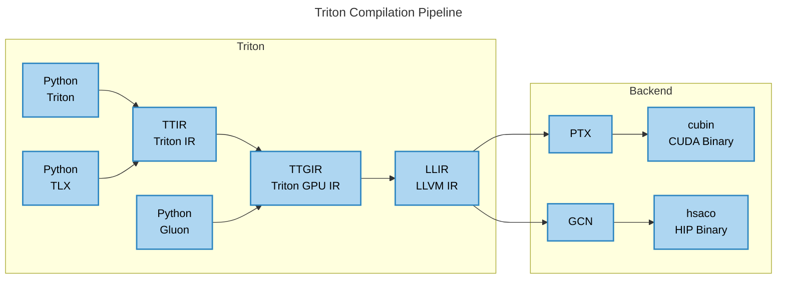
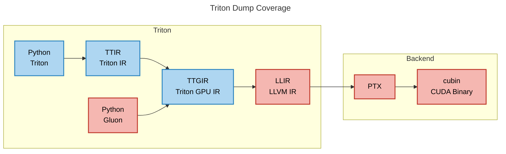

<h3 align="center">Multi-Level Triton Runner</h3>

<p align="center">
<a href="./doc/runner.md"><b>Runner Docs</b></a> |
<a href="./doc/dump.md"><b>Dump Docs</b></a> |
<a href="./doc/benchmark.md"><b>Benchmark Docs</b></a> |
<a href="./README.zh.md"><b>中文文档</b></a> |
<a href="https://triton-runner.org"><b>triton-runner.org</b></a>
</p>

<p align="center">
<b>English</b> | <a href="./README.zh.md"><b>中文</b></a>
</p>

Triton Runner is a lightweight execution and debugging layer for [Triton](https://github.com/triton-lang/triton). It lets you launch kernels from multiple compilation stages, inspect intermediate IR, and reuse compiled artifacts directly during performance tuning.

Compatibility summary:

- Supported Triton versions: `v3.0.0` through `v3.6.0`
- Primary target: `v3.5.x`
- Supported runner inputs: Python Triton, Gluon, TTIR, TTGIR, LLIR, PTX, cubin, AMDGCN, and hsaco
- Dump support: Python, TTIR, and TTGIR
- Optional CUDA bridge: TVM-FFI on Triton `v3.5+`
- MLIR split output: set `MLIR_ENABLE_DUMP=1` to expand `all.mlir` into per-pass files in the cache directory

## ✨ Features

- [I. Multi-Level Runner](#i-multi-level-runner)
- [II. Multi-Level Dump](#ii-multi-level-dump)
- [III. Benchmarks](#iii-benchmarks)
- [IV. Solving Triton Issues](#iv-solving-triton-issues)

## 📦 Installation

### Install from PyPI

```shell
pip install triton-runner
```

### Install from source

```shell
git clone https://github.com/toyaix/triton-runner
cd triton-runner
pip install -e .
```

### Optional: TVM-FFI

Triton Runner also provides a CUDA/cubin-only bridge to [TVM-FFI](https://github.com/apache/tvm-ffi) for Triton `v3.5+`.

```shell
pip install triton-runner[tvm-ffi]

pip install -e .[tvm-ffi]
export TRITON_RUNNER_ENABLE_TVM_FFI=1
```

## 🚀 Quick Start

- Multi-level runner examples: [examples/runner/README.md](./examples/runner/README.md)
- Dump examples: [examples/dump/README.md](./examples/dump/README.md)
- Benchmarks: [benchmark/README.md](./benchmark/README.md)
- Issue case studies: [doc/solving_triton_issues/README.md](./doc/solving_triton_issues/README.md)

## I. Multi-Level Runner

Triton Runner can launch kernels from multiple points in the Triton compilation pipeline.


```mermaid
---
title: Triton Compilation Pipeline
---
flowchart LR

    subgraph Triton
        A["Python<br>Triton"]:::supported --> B["TTIR<br>Triton IR"]:::supported
        B --> C["TTGIR<br>Triton GPU IR"]:::supported
        C --> D["LLIR<br>LLVM IR"]:::supported

        Gluon["Python<br>Gluon"]:::supported --> C
        TLX["Python<br>TLX"]:::supported --> B
    end

    subgraph Backend
        D --> E["PTX"]:::supported
        D --> G["GCN"]:::supported
        E --> F["cubin<br>CUDA Binary"]:::supported
        G --> H["hsaco<br>HIP Binary"]:::supported
    end

    classDef supported fill:#AED6F1,stroke:#2E86C1,stroke-width:2px,color:#000000;
    classDef unsupported fill:#F5B7B1,stroke:#C0392B,stroke-width:2px,color:#000000;
```

[TLX](https://github.com/facebookexperimental/triton) support is available for commit [9a7a23d](https://github.com/facebookexperimental/triton/commit/9a7a23d0cfa4ed4b37eb9b177b0e36beb254f9e6) in [examples/runner/tlx/README.md](./examples/runner/tlx/README.md).

### 1. Python Runner

Triton Runner supports two integration styles for Python kernels, and both are valid:

1. Replace `@triton.jit` with `@triton_runner.jit`
2. Monkey-patch Triton's decorators and keep using `@triton.jit`

If the module also uses `@triton.autotune`, call `triton_runner.configure_autotune_backend()` when using the monkey-patch style.

```python
import triton_runner

@triton_runner.jit
def kernel(...):
    ...
```

```python
import triton
import triton.language as tl
import triton_runner

triton_runner.configure_jit_backend()
# Optional when using @triton.autotune
# triton_runner.configure_autotune_backend()

@triton.jit
def kernel(...):
    ...
```

Examples:

- Python runner: [examples/runner/v3.5.x/python/matmul.py](./examples/runner/v3.5.x/python/matmul.py)
- cubin autotune with monkey patch: [examples/autotune/cubin/gate.py](./examples/autotune/cubin/gate.py)

```shell
python examples/runner/v3.5.x/python/matmul.py
```

On success, Triton Runner prints the kernel launch banner. When the kernel cache is reused, it also prints the cache location.

### 2. TTIR Runner

Provide the `.ttir` file and point the runner at its directory, typically with `ttir_dir=triton_runner.get_file_dir(__file__)`. See [examples/runner/v3.5.x/ttir/matmul/matmul.py](./examples/runner/v3.5.x/ttir/matmul/matmul.py).

You can also reuse the Triton cache generated by the Python runner.

```shell
python examples/runner/v3.5.x/ttir/matmul/matmul.py
```

### 3. TTGIR Runner

TTGIR is architecture-aware. Provide the matching `.ttgir` file and, when needed, the corresponding metadata JSON. See [examples/runner/v3.5.x/ttgir/sm90/matmul-with-tma-v4.py](./examples/runner/v3.5.x/ttgir/sm90/matmul-with-tma-v4.py).

If you hit `torch.AcceleratorError: CUDA error: an illegal instruction was encountered`, the selected TTGIR artifact likely does not match the target GPU, or the metadata JSON is missing.

### 4. LLIR / PTX / cubin Runner

For LLIR, PTX, and cubin launches, provide the input file plus the matching metadata JSON.

- LLIR example: [examples/runner/v3.5.x/llir/sm90/matmul-with-tma-v4.py](./examples/runner/v3.5.x/llir/sm90/matmul-with-tma-v4.py)
- PTX example: [examples/runner/v3.5.x/ptx/sm90/matmul-with-tma-v4.py](./examples/runner/v3.5.x/ptx/sm90/matmul-with-tma-v4.py)
- cubin example: [examples/runner/v3.5.x/cubin/sm90/matmul-with-tma-v4.py](./examples/runner/v3.5.x/cubin/sm90/matmul-with-tma-v4.py)
- Example metadata: [examples/runner/v3.5.x/llir/sm90/matmul_kernel_make_tensor_desciptor.json](./examples/runner/v3.5.x/llir/sm90/matmul_kernel_make_tensor_desciptor.json)

### 5. Gluon Runner

Gluon uses the same compiler stack as Triton but exposes a lower-level programming model. The repository currently includes two Gluon examples:

```shell
python examples/runner/v3.5.x/gluon/01-intro.py
python examples/runner/v3.5.x/gluon/02-layouts.py
```

### 6. Architecture Examples

Architecture-specific examples are collected in [examples/runner/README.md](./examples/runner/README.md).

- NVIDIA examples cover `sm75`, `sm80`, `sm86`, `sm90`, and `sm120`
- AMD examples for MI300/CDNA3 are under [examples/runner/amd/v3.6.0](./examples/runner/amd/v3.6.0)

Representative commands:

```shell
python examples/runner/v3.5.x/python/matmul-with-tma-v4.py
python examples/runner/v3.5.x/ttgir/sm90/matmul-with-tma-v4.py
python examples/runner/v3.5.x/cubin/sm90/matmul-with-tma-v4.py
python examples/runner/amd/v3.6.0/hsaco/matmul.py
```

If your GPU does not match one of the bundled examples, set `TRITON_CACHE_DIR=$PWD/.cache`, compile once on the target machine, and then reuse the generated kernel cache.

### 7. Versioned Examples

Use the example set that matches your Triton version:

- Triton `v3.6.0`: [examples/runner/v3.6.0](./examples/runner/v3.6.0)
- Triton `v3.5.x`: [examples/runner/v3.5.x](./examples/runner/v3.5.x)
- Triton `v3.4.0`: [examples/runner/v3.4.0](./examples/runner/v3.4.0)
- Triton `v3.3.x`: [examples/runner/v3.3.x](./examples/runner/v3.3.x)
- Triton `v3.2.0`: [examples/runner/v3.2.0](./examples/runner/v3.2.0)
- Triton `v3.1.0`: [examples/runner/v3.1.0](./examples/runner/v3.1.0)
- Triton `v3.0.0`: [examples/runner/v3.0.0](./examples/runner/v3.0.0)
- TLX examples: [examples/runner/tlx](./examples/runner/tlx)

## II. Multi-Level Dump

Triton Runner supports dump workflows at the Python, TTIR, and TTGIR levels.


```mermaid
---
title: Triton Dump Coverage
---
flowchart LR

    subgraph Triton
        A["Python<br>Triton"]:::supported --> B["TTIR<br>Triton IR"]:::supported
        B --> C["TTGIR<br>Triton GPU IR"]:::supported
        C --> D["LLIR<br>LLVM IR"]:::unsupported

        Gluon["Python<br>Gluon"]:::unsupported --> C
    end

    subgraph Backend
        D --> E["PTX"]:::unsupported
        E --> F["cubin<br>CUDA Binary"]:::unsupported
    end

    classDef supported fill:#AED6F1,stroke:#2E86C1,stroke-width:2px,color:#000000;
    classDef unsupported fill:#F5B7B1,stroke:#C0392B,stroke-width:2px,color:#000000;
```

The full dump guide lives in [examples/dump/README.md](./examples/dump/README.md).

### 1. Python Dump

Inside a Triton kernel, use `triton_runner.language.dump()` to inspect a block. You can also use `triton_runner.language.dump_boundary()` for boundary blocks and `triton_runner.language.dump_grids()` for grid inspection.

Representative examples:

```shell
python examples/dump/python/01-vec_add/dump_output.py
python examples/dump/python/03-matrix_multiplication/dump_acc.py
python examples/dump/python/04-softmax/dump_max_in_loop.py
python examples/dump/python/06-attention/dump_out.py
```

### 2. TTIR Dump

TTIR dump examples cover common ops such as `tt.load`, `arith.addf`, and `tt.trans`.

```shell
python examples/dump/ttir/01-vector_add/dump_addf.py
python examples/dump/ttir/03-matrix_multiplication/dump_acc.py
python examples/dump/ttir/04-softmax/dump_maxnumf.py
python examples/dump/ttir/06-attention/dump_out.py
```

### 3. TTGIR Dump

TTGIR dump examples cover the same class of operations at the GPU IR level.

```shell
python examples/dump/ttgir/01-vec_add/dump_addf.py
python examples/dump/ttgir/03-matrix_multiplication/dump_acc.py
python examples/dump/ttgir/04-softmax/dump_maxnumf.py
python examples/dump/ttgir/06-attention/dump_out.py
```

## III. Benchmarks

Benchmark examples are under [benchmark/README.md](./benchmark/README.md). The repository currently includes:

- `launch_latency`: kernel launch overhead
- `matmul`: matrix multiplication performance
- `flash_attention`: attention benchmark cases

Example commands:

```shell
python benchmark/launch_latency/bench.py
python benchmark/matmul/mma/bench.py
python benchmark/attn/flash_attention/bench.py
```

## IV. Solving Triton Issues

The case studies in [doc/solving_triton_issues/README.md](./doc/solving_triton_issues/README.md) show how to reproduce and work around Triton regressions with Triton Runner, especially by reusing cubin artifacts.

Current documented cases include:

- [Triton 3.3 performance regression on small GEMMs](./doc/solving_triton_issues/performance-7096)
- [Higher shared memory usage in Triton 3.3](./doc/solving_triton_issues/high_usage-7268)

## 📄 License

This project is licensed under the **MIT License**. See [LICENSE](./LICENSE) for details.

This project includes code from:

- Triton (MIT License): https://github.com/triton-lang/triton
- TritonBench (BSD 3-Clause License): https://github.com/pytorch-labs/tritonbench
