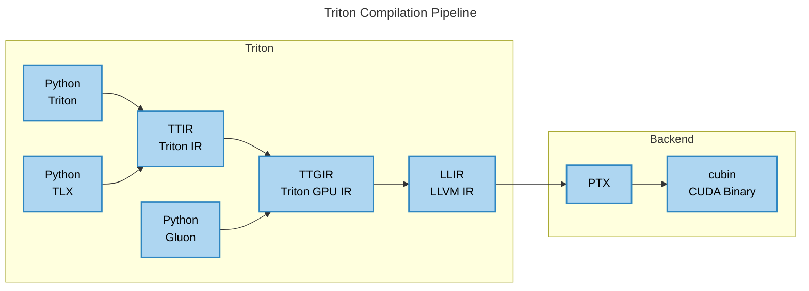

<h3 align="center">
Multi-Level Triton Runner(Dump) 🔧
</h3>

<p align="center">
<a href="./doc/"><b>Documentation</b></a> ｜ <a href="README.zh.md#用户文档"><b>用户文档</b></a> | <a href="https://triton-runner.org"><b>🔗 triton-runner.org</b></a>
</p>

<p align="center">
<a ><b>English</b></a> | <a href="README.zh.md"><b>中文</b></a>
</p>

Triton Runner is a lightweight, multi-level execution engine for [OpenAI/Triton](https://github.com/triton-lang/triton), designed to support IR/PTX/cubin launches in complex pass pipelines.

Triton Runner is compatible with Triton v3.5.0, **v3.4.0 (primary)**, v3.3.x, v3.2.0, v3.1.0 or v3.0.0.

Triton Runner supports multi-level dump across Python/TTIR/TTGIR on Triton **v3.4.0**.

## ✨ Features

- [I. Multi-Level Runner](#i-multi-level-runner)
- [II. Multi-Level Dump](#ii-multi-level-dump)
- [III. Benchmarks](#iii-benchmarks)
- [IV. Solving Triton Issues](#iv-solving-triton-issues)

## 📦 Installation

### Quick Installation

You can install the latest stable release of Triton from pip.

```shell
pip install triton-runner
```

### Install from source

You can install from source to access the latest features and developments.

```shell
git clone https://github.com/toyaix/triton-runner
cd triton-runner

pip install -e .
```

## 🚀 Quick Start

See the provided examples in the [triton-runner.org](https://triton-runner.org) repository for your first run.

### I. Multi-Level Runner

All of Triton’s compilation levels are supported by Triton Runner.



[TLX](https://github.com/facebookexperimental/triton) (Minimally Invasive Paths to Performance Portability) with commit [9a7a23d](https://github.com/facebookexperimental/triton/commit/9a7a23d0cfa4ed4b37eb9b177b0e36beb254f9e6) is supported in [examples/runner/tlx](examples/runner/tlx).

#### 1. Python Runner

You can run your Triton code using `@triton_runner.jit` instead of `@triton.jit`. See an example in [examples/runner/v3.4.0/python/matmul.py](./examples/runner/v3.4.0/python/matmul.py#L12)

You can run the example with `python examples/runner/v3.4.0/python/matmul.py`. After running successfully, you should see output like `[Triton Runner] Triton kernel`.

If the kernel cache is hit, the following message will be displayed: `[Triton Runner] Triton kernel cache hit and saved at`. This indicates that the kernel was compiled and cached during a previous run.

#### 2. TTIR Runner

In addition to using `@triton_runner.jit` instead of `@triton.jit`, you also need to provide the TTIR file. You can place it in the same directory as the current Python file and use `ttir_dir=triton_runner.get_file_dir(__file__)`. See an example in [examples/runner/v3.4.0/ttir/matmul.py](./examples/runner/v3.4.0/ttir/matmul.py#L67). Alternatively, you can use the Triton cache directory generated by the Python runner(previous step).

You can run the example with `python examples/runner/v3.4.0/ttir/matmul/matmul.py`.

#### 3. TTGIR Runner

TTGIR(Triton GPU IR) is architecture-aware and upwardly compatible. In the `.ttgir` file, you might see a target annotation like `ttg.target = "cuda:90"`, which specifies the GPU backend.

Similar to the `TTIR Runner`, you need to provide a `.ttgir` file and specify its location in the program. See an example in [examples/runner/v3.4.0/ttgir/sm90/matmul-with-tma-v4.py](./examples/runner/v3.4.0/ttgir/sm90/matmul-with-tma-v4.py#L76).

Because TTGIR is upwardly compatible, you can run the example using the `TTGIR Runner` with `python examples/runner/v3.4.0/ttgir/sm75/matmul.py`.

If you got `torch.AcceleratorError: CUDA error: an illegal instruction was encountered`, please add corresponding metadata JSON file.

#### 4. LLIR/PTX/cubin Runner

In addition to using `@triton_runner.jit` instead of `@triton.jit`, you also need to provide the corresponding file. Like the TTGIR runner, You can place it in the same directory as the current Python file and use `ttgir_dir=triton_runner.get_file_dir(__file__)`. Since all of them are architecture-specific, be sure to use the corresponding metadata JSON file. See an example in [examples/runner/v3.4.0/llir/sm90/matmul-with-tma-v4.py](./examples/runner/v3.4.0/llir/sm90/matmul-with-tma-v4.py#L76).

If your architecture is `sm90`(Hopper), you can run the example using the TTGIR runner with `python examples/runner/v3.4.0/llir/sm90/matmul-with-tma-v4.py`.

#### 5. Gluon Runner

Gluon is a GPU programming language based on the same compiler stack as Triton. But unlike Triton, Gluon is a lower-level language that gives the user more control and responsibility when implementing kernels.

Currently, only two cases are supported. Triton v3.5.0 has just been released, please wait for future updates.

```shell
python examples/runner/v3.4.0/gluon/01-intro.py
python examples/runner/v3.4.0/gluon/02-layouts.py
```

#### 6. Hopper Examples

I provide examples for different architectures and Triton versions. Here's example commands for multi-level targeting `sm90 (H100, H200, H20, etc.)` with Triton v3.4.0.

```shell
python examples/runner/v3.4.0/python/matmul-with-tma-v4.py
python examples/runner/v3.4.0/ttir/matmul-with-tma/matmul-with-tma-v4.py
python examples/runner/v3.4.0/ttgir/sm90/matmul-with-tma-v4.py
python examples/runner/v3.4.0/llir/sm90/matmul-with-tma-v4.py
python examples/runner/v3.4.0/ptx/sm90/matmul-with-tma-v4.py
python examples/runner/v3.4.0/cubin/sm90/matmul-with-tma-v4.py
python examples/runner/v3.4.0/gluon/01-intro.py
python examples/runner/v3.4.0/gluon/02-layouts.py
```

#### 7. More Architectures Examples

For [architecture-specific](https://developer.nvidia.com/cuda-gpus) example commands, please refer to the [examples/runner](./examples/runner) directory:
- sm90: Hopper (H100, H200, H20, etc.)
- sm80: Ampere (A100, A30)
- sm120: Blackwell (RTX PRO 6000, RTX 5090, etc.)
- sm86: Ampere (A10, RTX 3090, etc.)
- sm75: Turing (T4, RTX 2080, etc.)

If your GPU does not have one of the above compute capabilities, you can use `TRITON_CACHE_DIR=$PWD/.cache` to output the Triton cache to the current directory, and use this kernel cache directory to run your program.

#### 8. More Triton Version Examples

Please refer to the appropriate examples directory based on your Triton version:
- For Triton v3.5.0, in [examples/runner/v3.5.0](./examples/runner/v3.5.0).
- For Triton v3.4.0, in [examples/runner/v3.4.0](./examples/runner/v3.4.0).
- For Triton v3.3.1 or v3.3.0, in [examples/runner/v3.3.x](./examples/runner/v3.3.x).
- For Triton v3.2.0, in [examples/runner/v3.2.0](./examples/runner/v3.2.0).
- For Triton v3.1.0, in [examples/runner/v3.1.0](./examples/runner/v3.1.0).
- For Triton v3.0.0, in [examples/runner/v3.0.0](./examples/runner/v3.0.0).

### II. Multi-Level Dump

Python/TTIR/TTGIR now support dump on Triton v3.4.0.


#### 1. Python Dump

In addition to using `@triton_runner.jit` instead of `@triton.jit`, you also need use `triton_runner.language.dump()` in your Triton kernel. And we allocate a temporary tensor called dump_tensor, and simply pass it to the kernel through the dump_tensor parameter. Here are some example commands for dump. See more in [examples/dump/README.md](./examples/dump/README.md#1-python-dump).

```shell
python examples/dump/python/01-vec_add/dump_output.py
python examples/dump/python/03-matrix_multiplication/dump_acc.py
python examples/dump/python/04-softmax/dump_max_in_loop.py
python examples/dump/python/05-softmax_lse/dump_log_acc.py
python examples/dump/python/06-attention/dump_out.py
```

#### 2. TTIR Dump

Dump is supported for TTIR ops like `tt.load`, `arith.addf`, and `tt.trans` in Triton v3.4.0. Here are some example commands for dump. See more in [examples/dump/README.md](./examples/dump/README.md#2-ttir-dump).

```shell
python examples/dump/ttir/01-vector_add/dump_addf.py
python examples/dump/ttir/03-matrix_multiplication/dump_acc.py
python examples/dump/ttir/04-softmax/dump_maxnumf.py
python examples/dump/ttir/05-softmax_lse/dump_more.py
python examples/dump/ttir/06-attention/dump_out.py
```

#### 3. TTGIR Dump

Dump is supported for TTGIR level like `tt.load`, `arith.addf`, and `tt.trans` in Triton v3.4.0. Here are some example commands for dump. See more in [examples/dump/README.md](./examples/dump/README.md#3-ttgir-dump).

```shell
python examples/dump/ttgir/01-vec_add/dump_addf.py
python examples/dump/ttgir/03-matrix_multiplication/dump_acc.py
python examples/dump/ttgir/04-softmax/dump_maxnumf.py
python examples/dump/ttgir/05-softmax_lse/dump_more.py
python examples/dump/ttgir/06-attention/dump_out.py
```

### III. Benchmarks

Benchmarks Referencing [TritonBench](https://github.com/pytorch-labs/tritonbench)
  - `launch_latency`: Measures kernel launch overhead.
  - `matmul`: Provides a benchmark for matrix multiplication performance.

```shell
python benchmark/launch_latency/bench.py

python benchmark/matmul/mma/bench.py
```

### IV. Solving Triton Issues

To solve Triton’s performance and shared memory issues as shown in the [doc/solving_triton_issues](./doc/solving_triton_issues/) folder, we use the cubin Runner.


## 📄 License

This project is licensed under the **MIT License**.
See the [LICENSE](./LICENSE) file for more details.

This project includes code from:

- Triton (MIT License): https://github.com/triton-lang/triton

- TritonBench (BSD 3-Clause License): https://github.com/pytorch-labs/tritonbench
